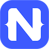

## Lesson 1. Learn the NativeScript Basics and Start Your First App

Welcome to the NativeScript & Angular getting started guide. In this hands-on tutorial, you’ll build a cross-platform iOS and Android app from scratch.

In this first lesson, you’ll learn what NativeScript is, and how to use the Playground environment to build your first app.

### Step 1. Learn how to use NativeScript Playground

The environment you’re in right now is called NativeScript Playground. NativeScript Playground.

NativeScript Playground is a browser-based environment for developing simple NativeScript apps. It’s a great place to get started learning NativeScript, as you can develop apps without needing to install the various SDKs and tools needed for native iOS and Android development—for now all you need is an Android or iOS device.

> **NOTE**: At the end of this tutorial you’ll learn about the tools you’ll want to use for professional application development, such as [NativeScript Sidekick](https://www.nativescript.org/nativescript-sidekick) and the [NativeScript command-line interface](https://github.com/NativeScript/nativescript-cli).

Let’s see how NativeScript Playground works in action.

#### Action

* **a.** Download and install the **NativeScript Playground** app on your iOS or Android device by either searching for “NativeScript Playground” in the iOS App Store or Google Play, or by using the links below.

* **b.** Download and install the **NativeScript Preview** app on your iOS or Android device by either searching for “NativeScript Preview” in the iOS App Store or Google Play, or by using the links below.

* **c.** Open the **NativeScript Playground** app on your device, and click the 

* **b.**

